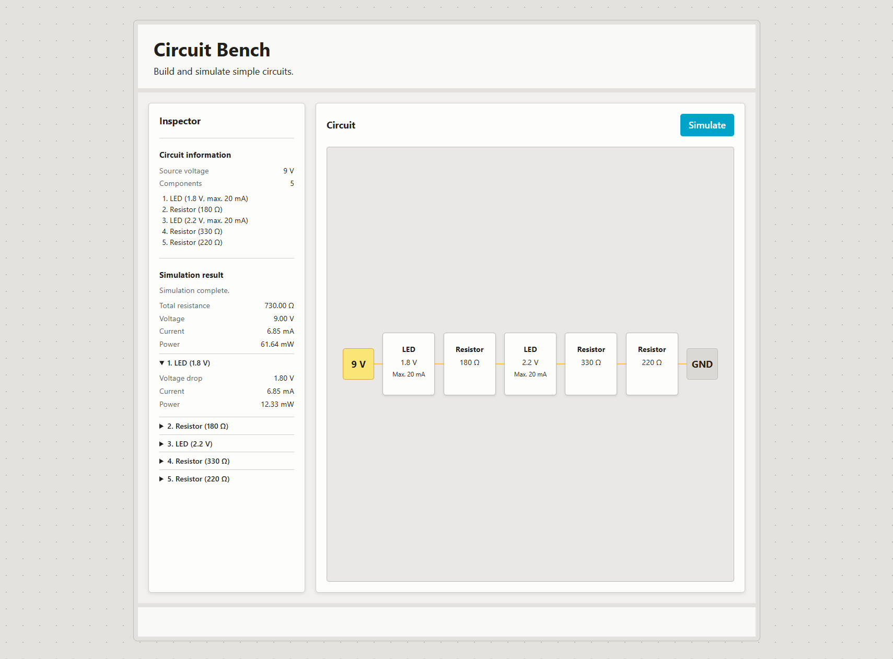

# CircuitBench

An interactive full-stack web application for building and simulating simple series circuits.



## About

CircuitBench is a small electronics workbench for experimenting with simple series circuits in the browser.

The current version has a working frontend-to-backend simulation flow for a fixed example circuit. The backend calculates circuit- and component-level values such as current, voltage drop, resistance, and power.

I am building the project to develop my full-stack web development skills through a concrete technical domain, while also strengthening my understanding of basic electronics.

## Technical notes

- The backend is an ASP&#46;NET Core API with the circuit simulation logic separated from the HTTP controller.
- Circuit components are represented using polymorphic DTOs, currently supporting resistors and LEDs.
- The frontend uses vanilla HTML, CSS, and TypeScript with Vite.
- The frontend and backend currently run as separate local applications and communicate through CORS.

## Current scope

- Simple DC series circuits
- Resistors and LEDs
- Circuit-level current, voltage, resistance, and power
- Per-component voltage drop, current, and power
- Frontend-to-backend simulation

The circuit displayed in the current frontend is still fixed. Dynamic component editing is the next major step.

## Tech stack

- C# / ASP&#46;NET Core
- TypeScript
- HTML
- CSS
- Vite
- Radix Colors

## Requirements

- .NET 10 SDK
- Node.js
- npm

## Quick start

Clone the repository:

```sh
git clone https://github.com/TordLoefgren/CircuitBench.git
cd CircuitBench
```

Start the backend:

```sh
dotnet run --project Backend --launch-profile https
```

In another terminal, start the frontend:

```sh
cd Frontend
npm install
npm run dev
```

Open the local URL printed by Vite.

## Roadmap

- Introduce frontend application state using a [functional core / imperative shell](https://www.destroyallsoftware.com/screencasts/catalog/functional-core-imperative-shell) structure
- Add, remove, and configure circuit components
- Add validation and safety feedback for circuit configurations
- Expand automated testing of simulation rules
- Explore runtime-extensible component definitions
